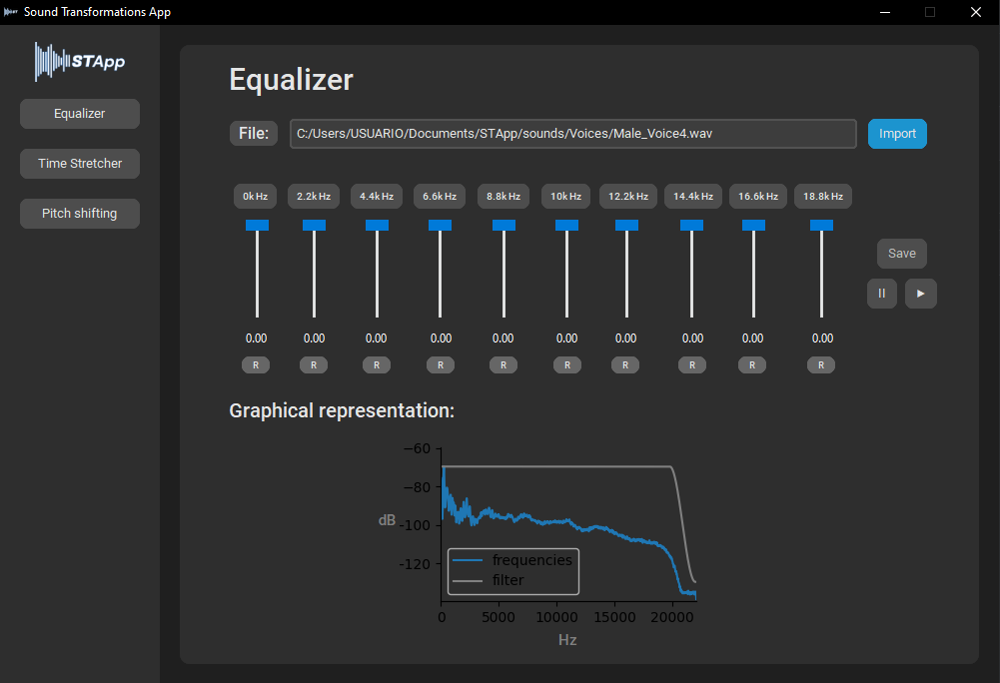

# STApp

Project description
----------
The purpose of the project is to build a standalone application software that can be executed to 
make sound transformations with intuitive interfaces. Those interfaces will tend to ensure facility 
for the user to make the sound transformations and modifications without a huge background knowledge 
of sound processing. The transformations that our application will focus on are equalization, pitch 
shifting and time stretching.

| _`complex_example.py` on Windows 11 with dark mode and 'dark-blue' theme_

How to Install and Run the Project
----------
**For developers:**

In order to use this software you have to install Python 3.8.x (recommended) in your computer. 
Then you should clone the GithHub repository to your computer: 

<code>git clone https://github.com/SoundTransformations/STApp.git </code>

Now you have the software in your computer. Regarding the visualization and edition of the code, you might need to install a python integrated 
development environment such as PyCharm Community (recommended) where you will need to configure the interpreter 
to <code>Python 3.8</code>. One you have configured the interpreter as <code>Python 3.8</code>, you should
install the following modules:
<code>ipython</code>, <code>numpy</code>, <code>matplotlib</code>, <code>scipy</code>, <code>cython</code>
and <code>sounddevice</code>, in order to be able tu run the software with all its dependencies.

**For users:**

As a user who only wants to make use of the application, you only need to download the executable file. 
You can find it on <code>Releases</code> section of the GitHub and just click into <code>STApp.exe</code>. 
Once you download it, you are ready to use the application.

How to Use the Application
-------
As a user you will enter to the equalizer interface as soon as you execute the application. 
Once you are inside the application, you are able to get around all transformations and switch 
between them by clicking the labeled buttons (left side of the interface). Our software is implemented 
in order to work offline without the need of internet connection. Sounds need to be stored in the 
system/computer before starting the development process, the application is thought to not be in 
real-time.

This app does not require authentication like passwords or usernames.

Code Content
-------

The project is structured in different folders.
On one hand, there is this folder called <code>Functions</code> where it can be found most of the 
coding part with its corresponding subdirectories for the <code>models</code> functions, the 
<code>transformations</code>, and the <code>GUIs</code> with all the interfaces' code. On the other 
hand, there is another folder called <code>sounds</code> in order to have some trial sounds and be 
able to play with the sound transformations. These sounds are split up among two folders: band playing 
and instrument sounds, and human voices audios. Finally, there is the <code>main.py</code> file which 
is the seed from where all interfaces and functions are called.

Authors
-------
Here is the list with all the collaborators:

- Albert Gubau Viñas: https://github.com/AlbertGubau 

- Andrea Sánchez Sarrablo: https://github.com/AndreaSanchezSarrablo
- Marc Rodríguez Jareño: 
- Nil Martí Valverde: https://github.com/U172772-NilMarti
- Paula Catà Coll: https://github.com/paulacata 

License
-------
All the software is distributed with the Affero GPL license (http://www.gnu.org/licenses/agpl-3.0.en.html), 
the lecture slides are distributed under Creative Commons Attribution-NonCommercial-ShareAlike 4.0 
(CC BY-NC-SA 4.0) license (http://creativecommons.org/licenses/by-nc-sa/4.0/) and the sounds in this 
repository are released under Creative Commons Attribution 4.0 (CC BY 4.0) license
(http://creativecommons.org/licenses/by/4.0/)

